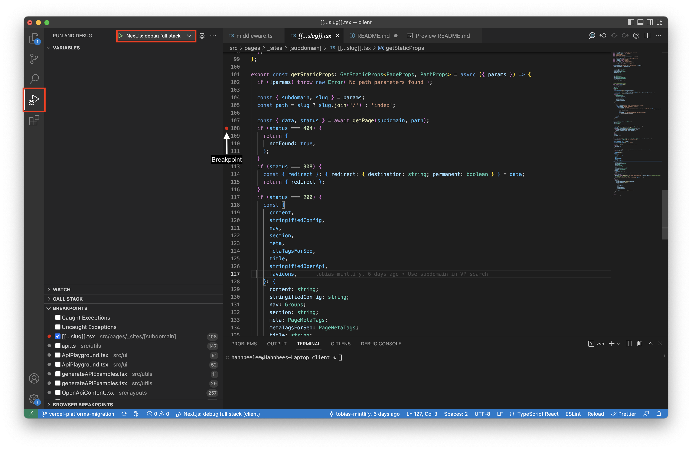

# Mintlify Client

The client is essentially a frontend template used to host documentation.

## Your First Code Contribution

Read the [Contributing guide](https://mintlify.com/docs/contributing) to learn about our development process, the standards and tools used, and how to propose fixes, bugs or open issues.

### Prerequisites

- Node v18 (npm v8)
- Yarn

### Dependencies

From a terminal, where you have cloned the repository, execute the following command to install the required dependencies:

```
yarn
```

### Local Development

- Log in to Infiscal for the .env variables. The project is `Mintlify Client`. Save those env vars to `client/.env`.
- Run `yarn dev`
- Navigate to `http://mintlify.localhost:3000/`

### Debugging in VS Code

Navigate to the VS Code debugger and select "Next.js: debug full stack"


Use the debugger to place breakpoints in your code to see your variable values. This is particularly useful for debugging the remark/rehype plugins because you can utilize it to see the abstract syntax tree (AST).

[Read more about debugging in VS Code](https://code.visualstudio.com/docs/editor/debugging)

### Code Quality

Check out the [Contribution Tools](https://mintlify.com/docs/contributing#contribution-tools) section in our [Contributing guide](https://mintlify.com/docs/contributing).

#### Formatting

This project uses [prettier](https://prettier.io/) for code formatting. You can auto-format across the codebase by running `yarn format`.

#### Linting

This project uses [eslint](https://eslint.org/) for code linting. You can check linter warnings and errors by running `yarn lint`.
